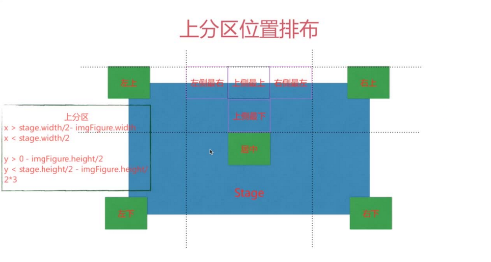
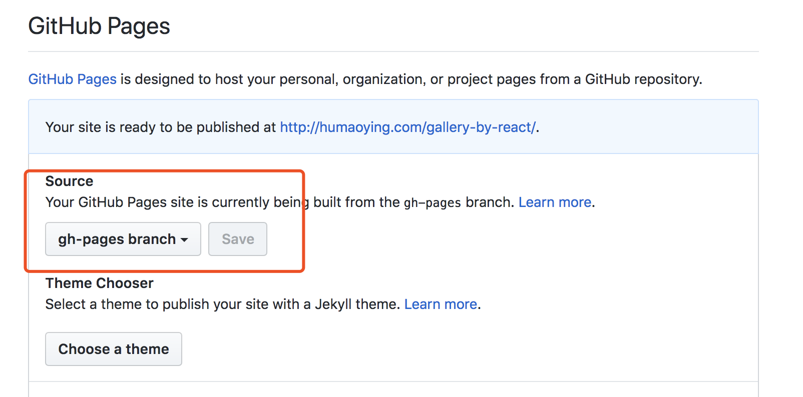

# 图片画廊

## 搭建项目框架

1. 使用 create-react-app 创建项目结构
2. 配置 eslint


## 项目开发

### 主要项目文件说明

1. images: 图片存放位置
2. imageData.json: 图片描述信息，包括文件名、文件标题、文件描述信息
3. App.js: 项目开发的主要逻辑文件

### 计算每张图片的位置

图片位置分布在四个区域，中间区域，上分区，左分区、右分区。其中中间区域显示一张图片，上部区域显示一张图片，左右显示剩下的等分数量的图片。每个分区使用四个坐标点来标志范围，x[0], x[1], y[0], y[1]。图片的位置在范围内随机计算。

**上分区**


**左右分区**


### 图片翻转

大致 DOM 结构大致如下，正常展示图片，翻转展示 hello：

```html
<div class="wrap" onclick="handleClick()">
	
	<div class="desc">hello</div>
</div>
```

其主要样式大致如下：

```css
.wrap {
	width: 100px;
	transform-origin: 0 0 0;
	/* 其子元素位于 3D 空间 */
	transform-style: preserve-3d;
    transition: transform .6s ease-in-out;
	/* 其他 */

}

.inverse {
	/* 右移 wrap 的宽度之后，y 轴翻转 180 度，desc 相当于翻转 360度，也就是不翻转了 */
	transform: translateX(100px) rotateY(180deg);;
}

.desc {
	/* 完全覆盖 父元素的空间 */
	position: absolute;
	left: 0px;
	top: 0px;
	height: 100%;
	width: 100%;
	background-color: #fff;
  	transform: rotateY(180deg) translateZ(1px);

	/* 其他 */

}
```

### Array.prototype.fill

需要注意下面这种用法：

```js
const a = Array(2).fill({ value: 0 })
const b = a.splice(0, 1)
b[0].value = 10
// 此时 a  = [{ value: 10 }] 而不是 [{ value: 0 }]
```

**用对象去初始化数组，所有的数组元素都指向这个对象，改变数组一个元素，影响所有的数组元素。**


### 打包

使用 `npm run build` 打包，然后执行 `git subtree push --prefix=build origin gh-pages`，将 build 文件夹下的内容推送到 gh-pages 分支，最后在 github 按照如下设置：



访问 [图片画廊](http://piaoyidage.github.com/gallery-by-react/)
